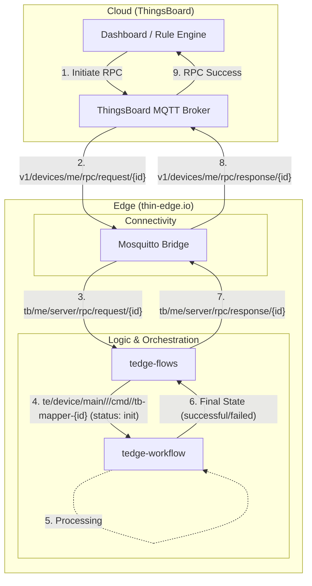
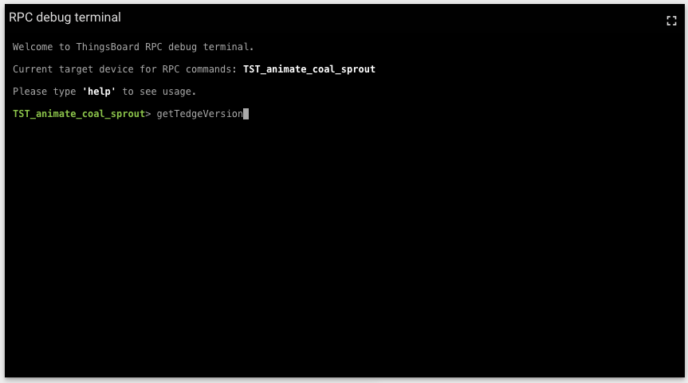
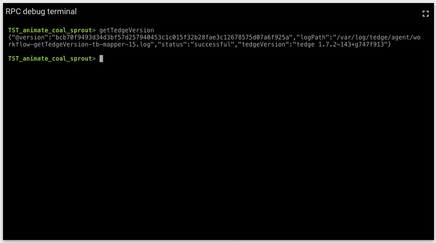

# End-to-End Guide: Using the ThingsBoard Server-Side RPC Flow

This guide provides a step-by-step implementation of the Server-side RPC flow, mapping cloud-side requests to edge-side workflows using `tedge-flows` and [`tedge-workflow`](https://thin-edge.github.io/thin-edge.io/references/agent/operation-workflow/).

## Architecture Overview

The following diagram illustrates the end-to-end communication flow.



## Preparations

Before you begin, ensure you have the following:

1.  **thin-edge.io** installed: If not, follow the [installation guide](https://thin-edge.github.io/thin-edge.io/install/).
2.  **ThingsBoard Community Edition** running: You can run it locally using Docker or use a cloud instance.
3.  **thingsboard-server-rpc** flow installed: If not, follow the installation guide using [`tedge-oscar`](https://github.com/thin-edge/tedge-oscar).

### A. Update Flow Configuration

Provide your main device (gateway device) name to the flow definition as described [here](../thingsboard/README.md#flow-configuration).

### B. Create Mosquitto Bridge Configuration

Create a configuration file to bridge ThingsBoard RPC topics to your local MQTT broker as described [here](../thingsboard/README.md#mosquitto-bridge-configuration).
After creating this file, restart the `mosquitto` service or reload the configuration.

### C. Create the Workflow Definition

Define how the edge should handle the `getTedgeVersion` method/command.

File: `/etc/tedge/operations/getTedgeVersion.toml`

```toml
operation = "getTedgeVersion"

[init]
  action = "proceed"
  on_success = "executing"

[executing]
  script = "/etc/tedge/operations/getTedgeVersion.sh"
  on_success = "successful"

[successful]
  action = "cleanup"

[failed]
  action = "cleanup"
```

File: `/etc/tedge/operations/getTedgeVersion.sh`

```sh
#!/bin/sh
set -e

VERSION=$(tedge --version)

echo ':::begin-tedge:::'
echo "{\"tedgeVersion\":\"$VERSION\"}"
echo ':::end-tedge:::'
```

Then, run `chmod` to make the script executable.

```
chmod +x /etc/tedge/operations/getTedgeVersion.sh
```

### D. Readiness Check

1. Run `tedge mqtt sub "#"` to check the bridge status is up as below.

   ```
   [te/device/main/service/mosquitto-things-bridge/status/health] 1
   ```

   If it's `1`, the connection to ThingsBoard is up.
   If it's `0`, check your mosquitto bridge configuration is correct.

2. Run `tedge flows list` to confirm if `thingsboard-rpc` flow is installed.
   If the output is like below, it's installed.

   ```sh
   $ tedge flows list
   /etc/tedge/mappers/flows/flows/thingsboard-rpc.toml
           /etc/tedge/mappers/flows/flows/thingsboard-rpc.js
   ```

## Detailed Execution Flow

With the environment prepared, let's trace how a single two-way RPC request travels through the system.

While doing the steps, subscribing to local bus is recommended to monitor how MQTT message are published locally.

```sh
tedge mqtt sub "#"
```

### Step 1 & 2: Initiate RPC from ThingsBoard

When you trigger an RPC from the ThingsBoard Dashboard (Step 1), the platform publishes a message to the broker (Step 2).

To initiate an RPC, open your ThingsBoard Dashboard and add the RPC debug terminal widget.
Ensure this widget is associated with your gateway (thin-edge.io) device.
In the terminal, type a command like getTedgeVersion and press Enter (Step 1).
The platform then publishes a message to the broker (Step 2).



- Topic: `v1/devices/me/rpc/request/{id}`
- Payload (Example): `{"method": "getTedgeVersion", "params": null}`

### Step 3: Local Bridge Mapping

The pre-configured Mosquitto Bridge automatically intercepts the cloud message and maps it to a local topic.
At this stage, the RPC request is available within the edge gateway's local MQTT bus.

- Local Topic (Mapped): `tb/me/server/rpc/request/{id}`

### Step 4: Transform to thin-edge.io Command (tedge-flows)

The **tedge-flows** engine subscribes to the local bridged topic.
It extracts the `method` and `id` to create a thin-edge.io command with `init` state.

- Output Topic: `te/device/main///cmd/getTedgeVersion/tb-mapper-{id}`
- Payload: `{"status": "init"}`

### Step 5 & 6: Workflow Execution

The **tedge-workflow** engine detects the init status and starts the process (Step 5).
Once the operation is complete (Step 6), it updates the command status.

- Example Workflow Logic: Executes `tedge --version` and captures the output.
- Resulting Status: The message on `te/device/main///cmd/getTedgeVersion/tb-mapper-{id}` is updated to `"status": "successful"`.

### Step 7: Convert Workflow Result to RPC Response

**tedge-flows** subscribes to `te/device/main///cmd/+/+` and listens for the `successful` or `failed` final states and prepares the response payload for ThingsBoard.

- Output Topic: `tb/me/server/rpc/response/{id}`
- Response Payload: `{"result": "thin-edge.io v1.2.3", "status": "successful"}`

### Step 8 & 9: Complete the RPC Loop

The Mosquitto Bridge automatically pushes the local response back to the cloud (Step 8).

- Cloud Topic: `v1/devices/me/rpc/response/{id}`

Finally, ThingsBoard receives the response, matching it with the original {id}, and displays the success result in your RPC debug terminal (Step 9).



## Handling RPC for Non-gateway Devices

When an RPC is targeted at a non-gateway device connected via the Gateway, ThingsBoard uses a gateway-specific topic structure.

### Topic Changes

- Cloud-side Topic: `v1/gateway/rpc`
- Local-side (Bridged): `tb/gateway/rpc`

### Payload Structure

Unlike direct RPC, the payload includes the device's name:

```json
{
  "device": "MAIN:device:child1",
  "data": {
    "id": 123,
    "method": "getTedgeVersion",
    "params": null
  }
}
```

### Flow Adaptation

In this scenario, tedge-flows subscribes to `tb/gateway/rpc` and parse the nested data object to trigger the workflow on the correct device
(e.g., `te/device/child1///cmd/getTedgeVersion/tb-mapper-123`).
