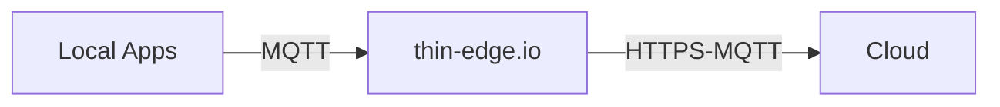
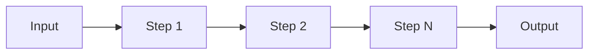
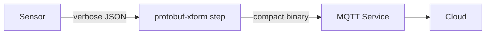
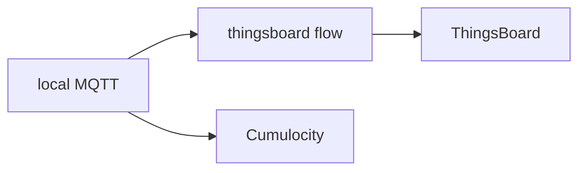
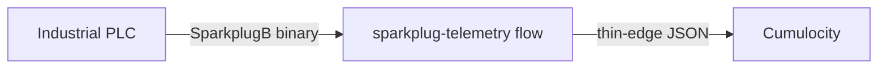

# thin-edge.io **Flows**

User-defined message pipelines for IoT edge devices

---

# Caveats

- Naming is still being updated

---
disabled: true
---

# thin-edge.io — quick context

An open-source, lightweight IoT framework for **Linux-based edge devices**.

- Bridges local sensors and services to cloud platforms (Cumulocity, AWS, Azure)
- Internal messaging over MQTT
- Handles device management: software updates, monitoring, remote access
- Designed for resource-constrained hardware




---
disabled: true
---

# The challenge

Real-world deployments rarely fit the default mapping behaviour.

| Scenario | Without flows |
|---|---|
| Devices use SparkplugB | Write and maintain a bespoke bridge service |
| Cellular link, every byte counts | Write a separate re-encoding service and pay the bandwidth cost |
| Need data in ThingsBoard too | Run a second, separate agent |
| Local analytics (e.g. detect log surges) | Write a custom script to tail logs, aggregate, and publish to MQTT — packaged as yet another service |
| Filter or rename fields before the cloud | Write a separate intermediary service to intercept and rewrite MQTT messages |

Each workaround is a separate service to build, test, and maintain.

---
disabled: true
---

# What are flows?

A **flow** is a user-defined message processing pipeline loaded by **any running mapper**.



- Defined in a **TOML** file — no recompile, no mapper restart
- Steps written in **JavaScript (ES2020)**
- The mapper **watches for file changes** and hot-reloads automatically
- Multiple flows run in isolation
- Supported mappers: `tedge-mapper-c8y`, `tedge-mapper-aws`, `tedge-mapper-az`, `tedge-mapper-local`

---
layout: two-cols
disabled: true
---

# Deploying flows to a mapper

Flows are **installed into** a specific mapper and share its lifecycle.

```
/etc/tedge/mappers/
  c8y/flows/   ← tedge-mapper-c8y
  aws/flows/   ← tedge-mapper-aws
  az/flows/    ← tedge-mapper-az
  local/flows/ ← tedge-mapper-local
               (new — no cloud required)
```

::right::

<br><br>

**Lifecycle is coupled to the mapper**

- Stopping a mapper **stops all its flows** — they are part of the same process
- Install flows under the mapper that matches their purpose
- Use `local` for on-device logic that doesn't depend on a cloud connection

---
disabled: true
---
# Four building blocks

| | |
|---|---|
| **Flow** | An end-to-end pipeline: connector → steps → connector. One TOML file per flow |
| **Connector** | Where messages come from or go to — MQTT topics, files, process stdout |
| **Steps** | A SmartFunction (JavaScript) module with exported `onMessage` / `onInterval` functions — sandboxed in QuickJS |
| **Context** | Shared key-value state scoped to mapper / flow / script |

---

# A flow in TOML

```toml
# /etc/tedge/mappers/c8y/flows/my-flow/flow.toml

input.mqtt.topics = ["te/device/main/+/+/m/+"]

[[steps]]
builtin = "add-timestamp"     # built-in step: attach an RFC 3339 timestamp
config.format = "rfc3339"

[[steps]]
script = "lib/main.js"        # SmartFunction — JavaScript (can be transpiled from TypeScript)
config.unit_map = "celsius"   # injected into context.config at runtime

[[steps]]
builtin = "limit-payload-size"
config.max_size = 64000
```

Drop this file into `/etc/tedge/mappers/<mapper>/flows/my-flow/flow.toml` — the mapper picks it up immediately.

---
layout: two-cols
---

# SmartFunctions

```typescript
export function onMessage(
    message: Message,
    context: Context
): Message[] {
    const utf8 = new TextDecoder("utf8");
    const p = JSON.parse(utf8.decode(message.payload));
    // ... transform ...
    return [{ topic: message.topic,
              payload: JSON.stringify(p) }];
}

// optional — called on a configurable interval
export function onInterval(
    time: Date,
    context: Context
): Message[] {
    // produce aggregated messages
}
```

::right::

```typescript
type Message = {
    topic: string;
    payload: Uint8Array;
    time: Date;
    mqtt?: { qos?: 0|1|2; retain?: boolean };
};

type Context = {
    config: Record<string, unknown>;    // from flow TOML
    mapper: KVStore;    // shared across all flows
    flow:   KVStore;    // shared within this flow
    script: KVStore;    // private to this step, persisted
};
```

---
layout: section
---

# Use-cases

---
layout: two-cols
---

# Edge analytics

Three independent flows for local intelligence:

**certificate-alert**
Polls `tedge cert show` every 10 minutes.
Raises an alarm if the certificate expiry is below a configured threshold.

**log-surge**
Tails `journalctl` output.
Counts log levels over 5-minute windows, raises an alarm if a threshold is exceeded.

**uptime**
Subscribes to service health MQTT topics.
Publishes uptime percentage as a retained twin property.

::right::

All three use `onInterval` to aggregate over time:

```typescript
export function onMessage(msg, ctx) {
    // buffer events into persistent state
    const buf = ctx.script.get("history") ?? [];
    buf.push({ time: msg.time, value: parse(msg) });
    ctx.script.set("history", buf);
    return []; // nothing to emit yet
}

export function onInterval(time, ctx) {
    const buf = ctx.script.get("history") ?? [];
    const stats = summarise(buf);
    return [{
        topic: "te/device/main///twin/stats",
        payload: JSON.stringify(stats),
        mqtt: { retain: true },
    }];
}
```

---

# Bandwidth reduction — Protobuf encoding

**Problem:** Cellular links are metered. The default thin-edge JSON format is verbose.

**Solution:** A flow re-encodes telemetry as binary Protobuf before forwarding to the cloud.



From `protobuf-xform/flow.toml`:
```toml
input.mqtt.topics = ["te/device/main/+/+/m/environment"]
[[steps]]
script = "lib/main.js"
config.topic = "${.params.outbound_topic}"
```

---
disabled: true
---

# Multi-cloud — ThingsBoard

**Problem:** thin-edge.io maps to Cumulocity by default. A second cloud needs a different format.

**Solution:** A flow translates and re-routes messages to ThingsBoard's MQTT API in parallel.



From `thingsboard/flow.toml`:
```toml
input.mqtt.topics = ["tbflow/device/+/+/+/m/+", "tbflow/device/+/+/+/a/+"]
[[steps]]
builtin = "add-timestamp"
config.format = "unix"
[[steps]]
script = "lib/main.js"
```

---

# Protocol bridge — SparkplugB

**Problem:** Industrial PLCs publish binary SparkplugB (Protobuf). The cloud expects thin-edge JSON.

**Solution:** A flow decodes SparkplugB payloads and re-publishes as standard measurements.



From `sparkplug-telemetry/flow.toml`:
```toml
input.mqtt.topics = [
    "spBv1.0/tedge/DDATA/+/+",
    "spBv1.0/tedge/NBIRTH/+",
]
[[steps]]
script = "lib/main.js"
```

No changes required to the PLC or its existing SparkplugB publisher.


---

# Input sources — not just MQTT

```toml
# Subscribe to MQTT topics
input.mqtt.topics = ["te/device/main/+/+/m/+"]

# Tail a log file (behaves like tail -F)
[input.file]
path  = "/var/log/my-app.log"
topic = "my-app-log"

# Run a command and consume each line as a message
[input.process]
command  = "sudo journalctl --no-pager --follow --unit tedge-agent"
topic    = "tedge-agent-logs"

# Or poll on an interval instead of following
[input.process]
command  = "sudo journalctl --no-pager --cursor-file=/tmp/cursor --unit tedge-agent"
interval = "1h"
```

Any process that writes to stdout can feed a flow directly.

---
layout: two-cols
---

# Parameterisation

Flow authors ship a `params.toml.template`:

```toml
# params.toml.template
# Days before expiry → warning alarm
warning = 30

# Days before expiry → critical alarm
alarm   = 7

disable_alarms = false
```

Operators copy it to `params.toml` and edit to suite.
No code changes. No redeployment.

::right::

<div class="pl-6">

<br>

Values are interpolated into the flow definition:

```toml
# certificate-alert/flow.toml
[input.process]
command  = "sh -c \"tedge cert show | tr '\\n' '\\0'\""
interval = "600s"

[[steps]]
script = "lib/main.js"
config.warning       = "${.params.warning}"
config.alarm         = "${.params.alarm}"
config.disable_alarms = "${.params.disable_alarms}"
```

One flow package — many deployments.

</div>

---

# Upgrading a flow

When a flow is updated, **`params.toml` is preserved** — operator configuration survives upgrades.

```
/etc/tedge/mappers/c8y/flows/certificate-alert/
  flow.toml        ← REPLACED on upgrade
  lib/
    main.js        ← REPLACED on upgrade
  params.toml.template  ← REPLACED on upgrade  (reference for new options)
  params.toml      ← PRESERVED  (operator's local config, never overwritten)
```

This means:

- Operators configure once, then receive bug fixes and new features without losing their settings
- `params.toml.template` is always updated to document any new parameters introduced in the new version
- Operators can diff `params.toml` against `params.toml.template` to see what new options are available

---
disabled: true
---
# Testing — offline, no MQTT needed

`tedge flows test` runs transformations against the local flow definitions without any live MQTT connection. Safe to run on a production device.

```bash
# Send a test message and inspect the output
$ tedge flows test te/device/main///m/environment '{"temperature": 29}'

[c8y/measurement/measurements/create]
{"type":"environment","temperature":{"temperature":{"value":29},"time":"2025-08-07T12:47:26Z"}
```

Flows can also be chained — the output of one becomes the input of the next:

```bash
$ tedge flows test collectd/device/cpu/percent-active '1754571280.572:2.07' \
    | tedge flows test

[c8y/measurement/measurements/create]
{"type":"collectd","time":"2025-08-07T12:54:40.572Z","cpu":{"percent-active":2.07}}
```

Use `--flows-dir` to test a development directory without touching the live config.

---
disabled: true
---

# Getting started

```bash
# 1. Flows are served by whichever mapper is already running
#    e.g. for Cumulocity:
tedge-mapper-c8y      # or: tedge-mapper-aws | tedge-mapper-az | tedge-mapper-local

# 2. Drop a flow into that mapper's watched directory
/etc/tedge/mappers/c8y/flows/   ← tied to tedge-mapper-c8y lifecycle
  my-flow/
    flow.toml       ← flow definition
    lib/main.js     ← compiled TypeScript step
    params.toml     ← optional operator config

# 3. The mapper hot-reloads — no restart needed

# Test a flow offline
tedge flows test te/device/main///m/env '{"temp": 22}'

# Install a packaged community flow
/etc/tedge/sm-plugins/flow install my-flow --version ./my-flow.tar.gz
```

Examples: https://github.com/thin-edge/tedge-flows-examples
Docs: https://thin-edge.github.io/thin-edge.io/next/references/mappers/flows/

---
layout: section
disabled: true
---

# Demo
## SparkplugB primer

---
disabled: true
---

# SparkplugB — what is it?

An MQTT application-layer protocol for **industrial IoT**, built on top of MQTT 3.1.1.

Designed for **SCADA / IIoT** use-cases where PLCs, sensors, and edge nodes need a structured, interoperable data model.

- **Binary payloads** — data encoded as Protobuf (compact, strongly typed); a **single `.proto` definition** covers the entire spec
- **Defined topic namespace** — `spBv1.0/<group>/<message-type>/<edge-node>/<device>`
- **State awareness** — the broker always knows whether a node is online or offline

---
disabled: true
---

# SparkplugB — message types

| Type | Direction | Purpose |
|---|---|---|
| `NBIRTH` / `DBIRTH` | Device → Host | Node/device comes online; declares all metrics and their **aliases** |
| `NDEATH` / `DDEATH` | Device → Host | Node/device goes offline (sent as MQTT Last Will) |
| `NDATA` / `DDATA` | Device → Host | Metric updates — reference metrics by **integer alias**, not full name |
| `NCMD` / `DCMD` | Host → Device | Downlink commands |

**Aliases** are the key bandwidth trick: `BIRTH` maps metric names → integer IDs once; all subsequent `DATA` messages use only the integer, not the full string name.

This means **subscribers must be stateful** — they need to cache the alias map from each `BIRTH` message in order to decode any `DATA` messages that follow. If a subscriber misses the `BIRTH` (e.g. connects late), it cannot interpret the data until the next `BIRTH` is received.

---
layout: center
---

# Live Demo
